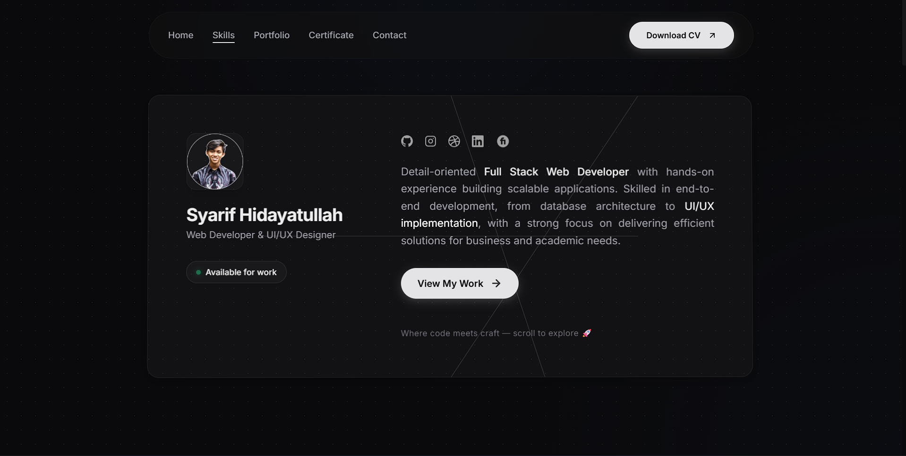

<div align="center">

# ✨ Syarif Hidayatullah — Personal Portfolio

A modern, high-performance personal portfolio website built with **React 19**, **Tailwind CSS v4**, and **GSAP** animations. Designed with a sleek dark theme, glassmorphism UI, and buttery smooth scroll-driven interactions.

[](https://syarif-portfolio.vercel.app)
[](https://react.dev)
[](https://tailwindcss.com)
[](https://vitejs.dev)

</div>

---

## 🖼️ Preview

<div align="center">



</div>

---

## 🚀 Features

| Feature | Description |
|---------|-------------|
| 🎨 **Dark Glassmorphism UI** | Premium dark theme with frosted glass effects, subtle gradients, and modern aesthetics |
| ⚡ **Smooth Scroll Animations** | GSAP-powered scroll-driven animations with ScrollSmoother, ScrollTrigger, and 3D card tilt effects |
| 📱 **Fully Responsive** | Optimized for all devices — mobile, tablet, and desktop with adaptive layouts |
| 🧭 **Smart Navbar** | Floating navbar with active section detection, smooth underline transitions, and mobile hamburger menu |
| 💼 **Portfolio Showcase** | Filterable project gallery with pagination, category tabs (Web Dev / UI-UX), and hover interactions |
| 📜 **Certificate Collection** | 50+ certificates from 5+ institutions with dedicated detail pages and PDF viewing |
| 🎯 **Scroll-to-Top Button** | Mobile-only floating button with glassmorphism style, appears on scroll |
| 🔗 **Contact Integration** | Direct email link, social media icons, and "Available for Work" status indicator |

---

## 🛠️ Tech Stack

<div align="center">

| Technology | Version | Purpose |
|:----------:|:-------:|---------|
|  **React** | v19 | UI library & component architecture |
|  **Tailwind CSS** | v4 | Utility-first styling & responsive design |
|  **Vite** | v7 | Lightning-fast build tool & dev server |
| 🟢 **GSAP** | Latest | Professional-grade animations (ScrollSmoother, ScrollTrigger, ScrollToPlugin) |
|  **React Router** | v7 | Client-side routing & hash navigation |

</div>

---

## ⚡ Getting Started

### Prerequisites

- **Node.js** v18+ recommended
- **npm** or **yarn**

### Installation

```bash
# Clone the repository
git clone https://github.com/Dunaman10/syarif-portfolio.git

# Navigate to the project directory
cd syarif-portfolio

# Install dependencies
npm install

# Start the development server
npm run dev
```

The app will be available at `http://localhost:5173`

### Build for Production

```bash
# Create optimized production build
npm run build

# Preview the production build
npm run preview
```

---

## 🎨 Design Highlights

- **Color Palette**: Custom dark theme with accent colors (`--color-accent`) and subtle gradients
- **Typography**: `heading-display` font for headings with tight tracking for a premium feel
- **Glass Effects**: `backdrop-blur`, semi-transparent borders, and layered shadows throughout the UI
- **Micro-Animations**: Hover tilt effects on cards (3D perspective), staggered entrance animations, and smooth scroll transitions
- **Status Indicator**: Animated green dot (`#1dbf73`) with glow effect for "Available for Work"

---

## 📬 Contact

<div align="center">

[](mailto:shidayatullah481@gmail.com)
[](https://www.linkedin.com/in/syarif-hidayatullah/)
[](https://github.com/Dunaman10)
[](https://dribbble.com/Dunaman)
[](https://www.fiverr.com/s/jjzVY3m)

</div>

---

<div align="center">

Made with ❤️ by **Syarif Hidayatullah**

*Web Developer & UI/UX Designer*

</div>
